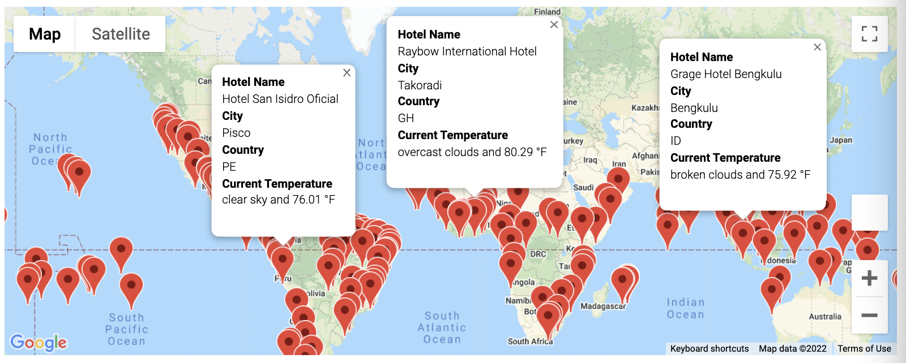
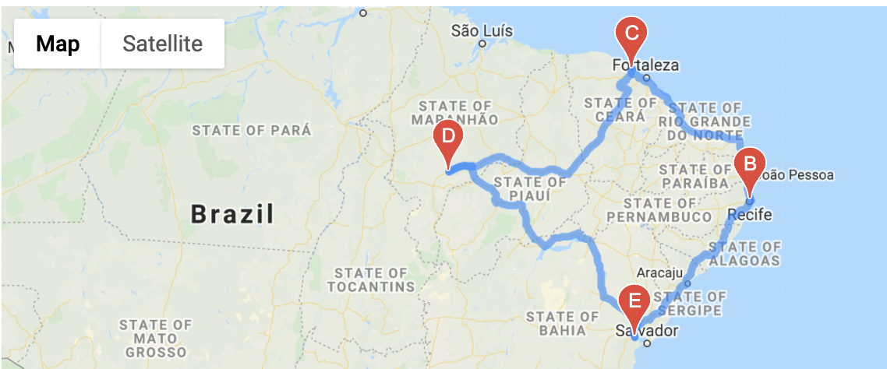
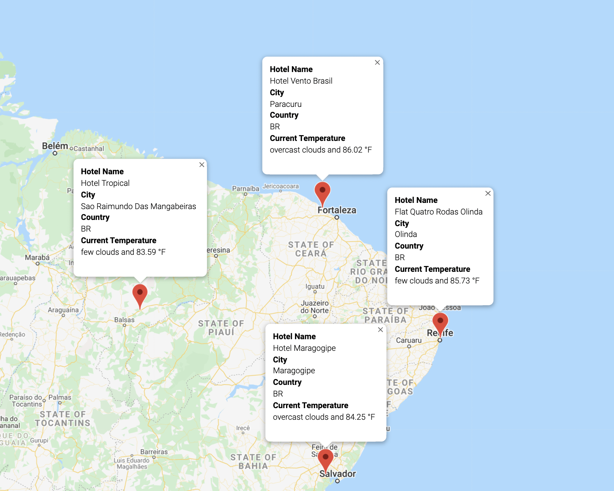

# World Weather Analysis with Google APIs

## Overview of the Project
PlanMyTrip is a top travel technology company that specializes in internet related services in the hotel and lodging industry. 

Jack is the head of analysis for the user interface team. He's asked for help to collect and present data for customers via the search page, which they will then filter based on their preferred travel criteria in order to find their ideal hotel anywhere. 

In the initial analysis, which can be found in the [WeatherPy](WeatherPy.ipynb) file, the following was done:
* Used the NumPy module to generate more than 1,500 random latitudes and longitudes.
* Used the citipy module to list the nearest city to the latitudes and longitudes.
* Used the OpenWeatherMap API to request the current weather data from each unique city in your list.
* Parsed the JSON data from the API request.
* Collected the following data from the JSON file and added it to a DataFrame:
    * City, country, and date
	* Latitude and longitude
	* Maximum temperature
	* Humidity
	* Cloudiness
    * Wind speed
I then created scatter plots and regression lines to show the correlation between the weather data across all cities. 

Additionally in the initial analysis, which can be found in the [VacationPy](VacationPy.ipynb) file, Create a heatmap with pop-up markers that can display information on specific cities based on a customer's travel preferences. 

Now, Beta testers of the PlanMyTrip app have recommended a few changes to take the app to the next level. Specifically, they recommended:
* adding the weather description to the weather data already retrieved
* have the beta testers use input statements to filter the data for their weather preferences, which will be used to identify potential travel destinations and nearby hotels
* From the list of potential travel destinations, the beta tester will choose four cities to create a travel itinerary. 
* Finally, using the Google Maps Directions API,  create a travel route between the four cities as well as a marker layer map.

## Retrieved Weather Data 
Generated a set of 2,000 random latitudes and longitudes, retrieved the nearest city, and performed an API call with the OpenWeatherMap. Used API skills to retrieve the current weather description for each city. Then, created a new DataFrame containing the updated weather data.

For more information on how this was done, see the [Weather_Database](Weather_Database/Weather_Database.ipynb) file in the Weather_Database folder. 

The list of cities and their weather data can be found in the [WeatherPy_Database](Weather_Database/WeatherPy_Database.csv) CSV file. 

## Created a Customer Travel Destinations Map
Used input statements to retrieve customer weather preferences, then used those preferences to identify potential travel destinations and nearby hotels. Then, showed those destinations on a marker layer map with pop-up markers.

For more information on how this was done, see the [Vacation_Search](Vacation_Search/Vacation_Search.ipynb) file in the Vacation_Search folder. 

The list of cities that meet the customer weather critiera can be found in the [WeatherPy_vacation](Vacation_Search/WeatherPy_vacation.csv) CSV file. 

The marker layer map is shown below. 

## Created a Travel Itinerary Map
Useed the Google Directions API to create a travel itinerary that shows the route between four cities chosen from the customer’s possible travel destinations. Then, created a marker layer map with a pop-up marker for each city on the itinerary.

For more information on how this was done, see the [Vacation_Itinerary](Vacation_Itinerary/Vacation_Itinerary.ipynb) file in the Vacation_Itinerary folder. 

The travel map is shown below. 

The marker layer map is shown below. 

